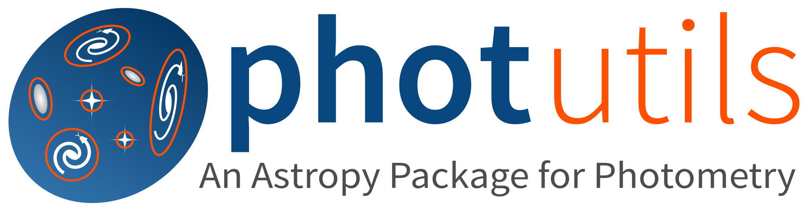
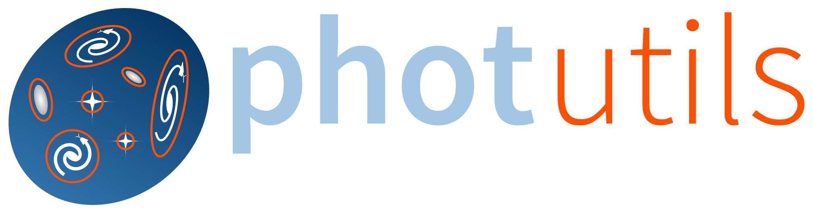

:tocdepth: 3

.. |br| raw:: html

    

*********
Photutils
*********

| **Version**: |release| -- **Date**: |today|
| Useful links: :doc:`getting_started/install` | :ref:`whatsnew-2.2`

**Photutils** is a Python library that provides commonly-used tools
and key functionality for detecting and performing photometry of
astronomical sources. Tools are provided for background estimation,
star finding, source detection and extraction, aperture photometry,
PSF photometry, image segmentation, centroids, radial profiles,
and elliptical isophote fitting. It is a `coordinated package
<https://www.astropy.org/affiliated/index.html>`_ of `Astropy`_ and
integrates well with other Astropy packages, making it a powerful tool
for astronomical image analysis.

.. admonition:: Important

    If you use Photutils for a project that leads to a publication,
    whether directly or as a dependency of another package, please
    include an :ref:`acknowledgment and/or citation <citation>`.

|br|

.. toctree::
    :maxdepth: 1
    :hidden:

    getting_started/index
    user_guide/index
    reference/index
    development/index
    Release Notes <changelog>

.. grid:: 3
    :gutter: 2 3 4 4

    .. grid-item-card::
        :text-align: center

        **Getting Started**
        ^^^^^^^^^^^^^^^^^^^

        New to Photutils? Check out the getting started guides. They
        contain an overview of Photutils and an introduction to its main
        concepts.

        +++

        .. button-ref:: getting_started/index
            :expand:
            :color: primary
            :click-parent:

            To the getting started guides

    .. grid-item-card::
        :text-align: center

        **User Guide**
        ^^^^^^^^^^^^^^

        The user guide provides in-depth information on the key concepts
        of Photutils with useful background information and explanation.

        +++

        .. button-ref:: user_guide/index
            :expand:
            :color: primary
            :click-parent:

            To the user guide

    .. grid-item-card::
        :text-align: center

        **API Reference**
        ^^^^^^^^^^^^^^^^^

        The reference guide contains a detailed description of the
        functions, modules, and objects included in Photutils. It
        assumes that you have an understanding of the key concepts.

        +++

        .. button-ref:: reference/index
            :expand:
            :color: primary
            :click-parent:

            To the reference guide
