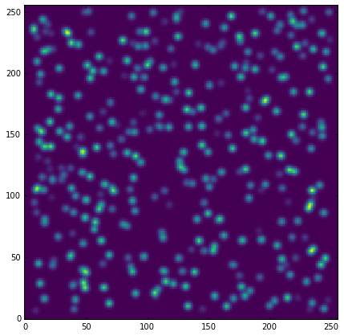
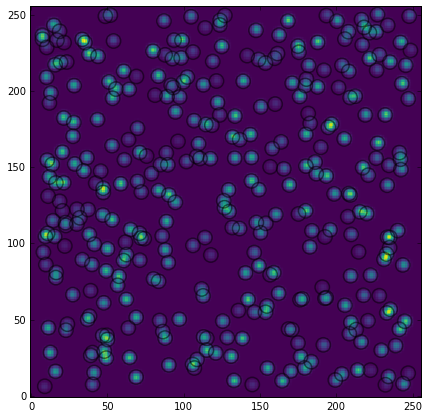
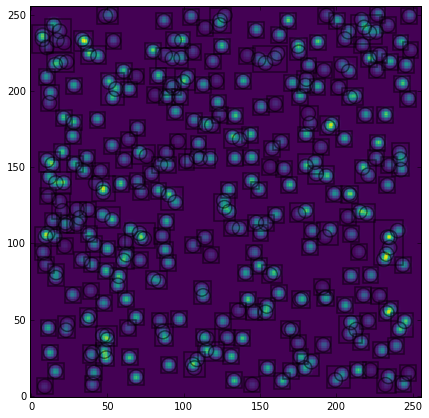

Grouping Algorithms
===================

Introduction
------------

In Point Spread Function (PSF) photometry, a grouping algorithm is primarily
used to divide a star list into optimum groups. More precisely, a grouping
algorithm must be able to decide whether two or more stars belong to the same
group, i. e., whether there are any pixels whose counts are due to the linear
combination of counts from two or more sources.

DAOPHOT GROUP
-------------

Stetson, in his seminal paper (`Stetson 1987, PASP 99, 191
<http://adsabs.harvard.edu/abs/1987PASP...99..191S>`_), provided a simple and
powerful grouping algorithm to decide whether or not the profile
of a given star extends into the fitting region around the centroid of any
other star. This goal is achieved by means of a variable called "critical
separation", which is defined as the distance such that any two stars
separated by less than it would be overlapping. Stetson also gives intutive
reasoning to suggest that the critical separation may be defined as the
product of fwhm with some positive real number.

Grouping Sources
^^^^^^^^^^^^^^^^

Photutils provides an implementation of DAOPHOT GROUP in the
:class:`~photutils.psf.DAOGroup` class. Let's take a look at a simple example.

.. code:: python

    # Import required modules

.. code:: python

    %matplotlib inline
    import numpy as np
    from photutils.datasets import make_gaussian_sources
    from photutils.datasets import make_random_gaussians
    from photutils.datasets import make_noise_image
    import matplotlib.pyplot as plt
    from matplotlib import rcParams
    rcParams['image.cmap'] = 'viridis'
    rcParams['image.aspect'] = 1  # to get images with square pixels
    rcParams['figure.figsize'] = (7,7)

.. code:: python

    # Make Gaussian sources

.. code:: python

    n_sources = 350
    min_flux = 500
    max_flux = 5000
    min_xmean = min_ymean = 6
    max_xmean = max_ymean = 250
    sigma_psf = 2.0
    starlist = make_random_gaussians(n_sources, [min_flux, max_flux],\
               [min_xmean, max_xmean], [min_ymean, max_ymean],\
               [sigma_psf, sigma_psf], [sigma_psf, sigma_psf],\
               random_state=1234)
    shape = (256, 256)
    sim_image = make_gaussian_sources(shape, starlist)
    plt.imshow(sim_image, origin='lower', interpolation='nearest')

.. parsed-literal::

    <matplotlib.image.AxesImage at 0x109e03b70>

.. code:: python

    # Rename the centroids column names, so that they agree with the
    # names that DAOGroup expect:

.. code:: python

    starlist['x_mean'].name = 'x_0'
    starlist['y_mean'].name = 'y_0'

.. code:: python

    # Plot circular apertures around the sources and plot them:

.. code:: python

    from photutils import CircularAperture
    from astropy.stats import gaussian_sigma_to_fwhm
    circ_aperture = CircularAperture((starlist['x_0'], starlist['y_0']),
                                     r=sigma_psf*gaussian_sigma_to_fwhm)
    plt.imshow(sim_image, origin='lower', interpolation='nearest')
    circ_aperture.plot(lw=1.5, alpha=0.5)

.. code:: python

    # Find the groups of overlapping sources:

.. code:: python

    from photutils.psf.groupstars import DAOGroup
    fwhm = sigma_psf*gaussian_sigma_to_fwhm
    daogroup = DAOGroup(crit_separation=1.5*fwhm)
    star_groups = daogroup(starlist)
    star_groups = star_groups.group_by('group_id')

.. code:: python

    # Plot rectangular apertures (which is actually the region that is used
    # to do simultaneous fitting) which cover each group:

.. code:: python

    from photutils import RectangularAperture
    plt.imshow(sim_image, origin='lower', interpolation='nearest')
    for group in star_groups.groups:
        group_center = (np.median(group['x_0']), np.median(group['y_0']))
        xmin = np.min(group['x_0']) - fwhm
        xmax = np.max(group['x_0']) + fwhm
        ymin = np.min(group['y_0']) - fwhm
        ymax = np.max(group['y_0']) + fwhm
        group_width = xmax - xmin + 1
        group_height = ymax - ymin + 1
        rect_aperture = RectangularAperture(group_center, group_width,
                                            group_height, theta=0)
        rect_aperture.plot(lw=1.5, alpha=0.5)
    circ_aperture.plot(lw=1.5, alpha=0.5)

